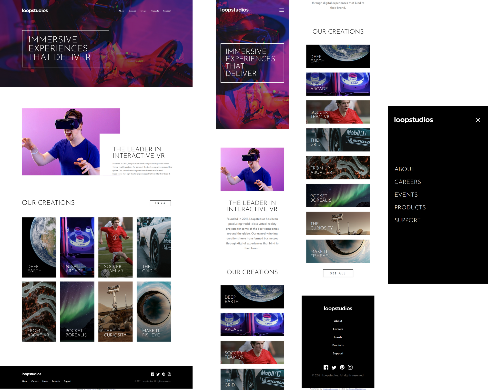

# Frontend Mentor - Loopstudios landing page solution

This is a solution to the [Loopstudios landing page challenge on Frontend Mentor](https://www.frontendmentor.io/challenges/loopstudios-landing-page-N88J5Onjw). Frontend Mentor challenges help you improve your coding skills by building realistic projects. 

## Table of contents

- [Overview](#overview)
  - [Links](#links)
  - [The challenge](#the-challenge)
  - [Screenshot](#screenshot)
- [My process](#my-process)
  - [Built with](#built-with)
  - [What I learned](#what-i-learned)
  - [Continued development](#continued-development)
- [Author](#author)
- [Acknowledgments](#acknowledgments)

## Overview

### Links

- Live Site URL: https://allisondev16.github.io/loopstudios-landing-page-main/

### The challenge

Users should be able to:

- View the optimal layout for the site depending on their device's screen size
- See hover states for all interactive elements on the page

### Screenshot



## My process

### Built with

- CSS BEM
- SCSS
- CSS Grid
- Flexbox
- JavaScript
- Semantic HTML5 markup
- Mobile-first workflow

### What I learned

- Learned using function in SCSS to convert px to rem.

- To remove the unwanted height of the anchor tag:
  ```css
  vertical-align: bottom;
  ```
  Reference: https://stackoverflow.com/questions/27999522/anchor-tag-generates-unwanted-height

- ">" means direct child in CSS/SCSS.
  Reference: https://stackoverflow.com/questions/11894054/why-use-in-css

- Darken the background image using linear-gradient
  Reference: https://dev.to/nazanin_ashrafi/how-to-darken-an-image-with-css-4f5h

- The unit of measure, vh and vw, is relative to 1% of the height/width of the viewport
  Reference: https://www.w3schools.com/cssref/css_units.asp

- Use background-image in css instead of the img tag to be able to change the image through media query.

- Using CSS Grid

- Centering a button inside a div by adding text-align:center on the parent div.
  Reference: https://stackoverflow.com/questions/3622756/button-center-css

- When I tried to apply opacity for the backgorund-image when hovered but the text is also affected, so I used pseudo-element ::before to separate the background-image to the parent div, thank you Coder Coder (Reference: https://www.youtube.com/watch?v=LQsjNmkqUOc)

- The "interactive" section was tricky. At first, I used margin-left and left for position: absolute, but I realized that when the screen size changes, the elements are not being centered. Hence, I used margin-left and margin:right as auto and adjusted the position of the elements from the center using position relative and absolute.

### Continued development

I want to improve creating the navigation bar for mobile. It's tricky to position the navigation window. I also want to be skilled in applying the transition when the navigation window expands and collapses.

### Useful resources

- [How to Make a Landing Page using HTML, SCSS, and JavaScript - Full Course](https://www.youtube.com/watch?v=aoQ6S1a32j8&list=PLtTuvXCqdhRA2fOEMPhiBR8v6FcRCWHbi&index=7&t=3574s) - This helped me for completing this landing page. I learned the ways of working of a skilled developer. This course was created by Jessica Chan a.k.a. Coder Coder.

## Author

- GitHub - [Allison Mamangun](https://github.com/allisondev16)
- Frontend Mentor - [@allisondev16](https://www.frontendmentor.io/profile/allisondev16)

## Acknowledgments

I thank Coder Coder on YouTube for her content to share her expertise in frontend development. I also want to thank Dr. Angela Yu for teaching me the basics of HTML, CSS, and JavaScript. Both of them introduced me to Frontend Mentor, so thank you!
